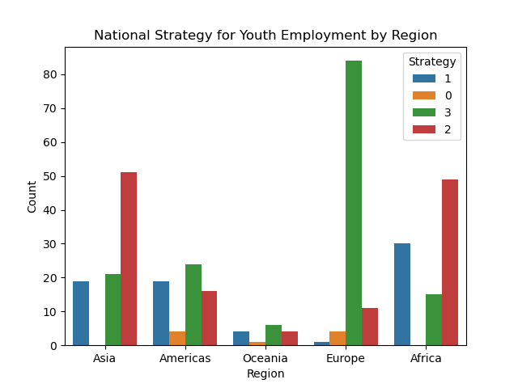
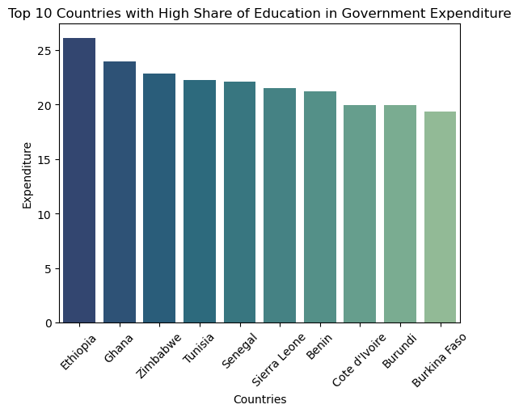
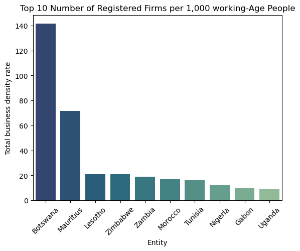
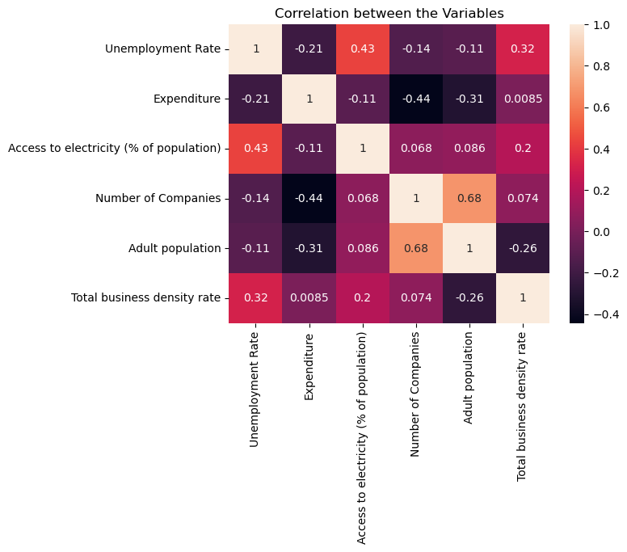

## Unraveling the Challenges of Unemployment in Africa: _A Data-Driven Approach_

---

## Introduction
This is a project for the **10Alytics Global Hackathon 2023** which allowed analysts to delve into various datasets to uncover insights and strategies that could assist in mitigating the unemployment crisis in Africa. 

## Objective
To analyze data, identify patterns, and propose informed, data-driven and actionable recommendations that governments and stakeholders can implement to effectively address and reduce unemployment rates, particularly focusing on the African context.

## Data Description
Six datasets were provided with each having unique information on the factors influencing unemployment. The datasets are outlined below as described for the hackathon.
- Unemployment Rate (Men vs. Women): This dataset provides a comparative view of unemployment rates between genders.
- National Strategy for Youth Employment: This dataset outlines various national strategies adopted across different African countries to combat youth unemployment.
- Share of Education in Government Expenditure: This dataset sheds light on how much governments are investing in education.
- Population with Access to Electricity: Access to electricity is a fundamental driver of economic development and can influence employment opportunities. This dataset provides insights into the availability of electricity across different regions and its potential impact on employment.
- Total Firms (Historical Data): The health of a country's private sector is directly linked to employment rates. This dataset includes historical data on the number of firms.
- Country Codes: This dataset is essential for mapping data points to specific African countries, enabling a more precise and geographically contextual analysis.

## Skills / Concepts Demostrated
- Data Manipulation with Pandas
- Data Visualization
- Data Analysis
- Proficiency in Python Programming Language

## Data Cleaning and Transformation
The datasets were provided in a csv format and were imported into jupyter notebook using the pandas library. Data cleaning and transformation were all carried out using python. The cleaning was done separately for each dataset.

The unemployment rate dataset has 58578 records and 7 features. They had no duplicates and in the right data types. The year column has some negative entries and there were missing rows of 52347 in both male and female unemployment rates column. It was then confirmed that both columns have exact rows with missing values. Hence, they were dropped. The rows with negative in the year column got removed along with the missing values. The continent column has missing rows. To tackle this, the dataset was merged with the country code dataset that has the continents. Some columns were renamed to short and meaningful names and some unwanted columns were deleted.Another column was created for the average unemployment rates for both male and female across the rows which would be useful for the analysis.

The dataset for national strategy for youth employment had no duplicates, no missing values and in correct datatype. The dataset was also merged with the country code dataset to have the regions and subregions required for analysis. Some unwanted columns were dropped after merging and others renamed meaningfully.

The dataset for the share of education in government expenditure had missing values in the code column that contains three letter code representing each country. These rows were filtered and were not identified as countries. Hence no codes for them and were removed. It was also merged with the country code dataset for the same reason.

The dataset for the population with access to electricity also had missing values in the code columns and were filtered and not identified as countries. These rows were then removed.

The dataset for the total number of firms had 4 missing values and were dropped as all the columns were NaN. It was merged with the country code dataset and the code column had missing values. They were filtered and errors such as misspellings, empty space, non-alphabets were identified and corrected. The codes, regions and subregions for some countries were inputed.

## Exploratory Analysis

The exploratory analysis was performed for all the variables by gender, region and countries (in Africa). For recency, the years connsidered in this analysis sttarts from 2010.

### _Regional Analysis_

Analysis was carried out for a wider context considering all the regions for the effect of access to electricity, share of education in government expenditure, the government startegies and the business density rate on unemployment. Also, the unemployment rate was explored by gender. The Unemployment trend by gender and region are shown below
'                                          | '                       
:-----------------------------------------:|:-----------------------:
                  | 

The percentage of population that have access to electricity is most likely to influence the the number of companies present in a region. The plots below show the percentage of population with access to electricity and the number of registered firms per 1000 working age people in each region.

'                                           | '                      
:-----------------------------------------:|:-----------------------:
             |  

The government put in place several strategies to reduce unemployment and also invest certain percentage of their expenditure in education. In this case, the strategies are in 4 categories namely: 0 for no strategy, 1 for developing strategy, 2 for strategy adopted and 3 for the operationalized strategies. The plots below show the distribution of these strategies and the educational expenditure for each region.
'                                           | '                     
:-----------------------------------------:|:-----------------------:
!               |  

### _Analysis for Africa_
The main focus of this case study is on the African context. The following analysis were done to determine the effcet of all these variables on unemployment rates in Africa. It has been established in the regional analysis that Africa has the highest unemployment rates. The plots below show the top countries in Africa with the highest and lowest unemployment rates.
'                                          | '
:-----------------------------------------:|:-----------------------:
             |  

### _National Strategies for Youth Employment_
Africa has more of developing and adopted strategy than the operationalized strategies. The operationalized strategies were focused on because it is expected to have improved unemployment rates.
To check how the operationalized strategies have improved the unemployment rates, the countries with operationalized strategies in africa were selected and their corresponding unemployment rates. The dataset for the strategy starts from 2019, then the unemployment rates from 2018 were considered.
'                                      | '
:-----------------------------------------:|:-----------------------:
|  

### _Share of Education in Government Expenditure_
This shows the percentages of government expenditure that has been invested in education from 2010 for different african countries. The top 10 countries with most share and their unemployment trend are shown below.

'                                       | '
:-----------------------------------------:|:-----------------------:
             |  

African Countries with low share of education in government expenditure and their unemployment trends are shown below.
'                                       |'
:-----------------------------------------:|:-----------------------:
             |  

### _Share of Population with Access to Electricity_
Compared to other regions, Africa has the least percentage of their population with access to electricity. The top 10 countries in Africa that most percentage of their population have access to electricity and their unemployment trends are shown below 
'                                     | '
:-----------------------------------------:|:-----------------------:
             |  

The bottom 10 countries in Africa that have low percentage of their population with access to electricity and their unemployment trend are shown below.

'                                    |'
:-----------------------------------------:|:-----------------------:
             |  

### _Total Business Density Rates_
Africa has the least total business density rates when compared to other reions. The top 10 countries in Africa that have high number of registered firms per 1,000 working-age people is shown here and their respective unemployment trends.
'                                    |'
:-----------------------------------------:|:-----------------------:
             |  

The bottom 10 countries in Africa with low number of registered firms per 1,000 working-age people is shown here and their respective unemployment trends

'                                    |'
:-----------------------------------------:|:-----------------------:
             |  

### _Relationship between all Variables_
To further identify the relationships between the variables, the Pearson correlation codefficient was used to generate the correlation matrix where a positive value indicates a positive linear relationship, a negative value indicates a negative linear relationship, and a value of zero indicates no linear relationship.This is shown in the heatmap below.
            

# Insights
- There is a higher female unemployment rate than male unemployment rate
- There is an increase in unemployment rate in 2019 for all regions which may be a result of COVID and slight decrease from 2020 in other regions except for Africa
- Europe has the highest number of operationalized strategies (84) while Africa has the least (15)
- High number of operationalized strategies, high percentage of population with access to electricity, high total business density rate and share of education in goernment expenditure can be seen to have significantly 
 contributed in lower unemployment rates in other regions except Africa with the opposite.

- 

# Recommendations
