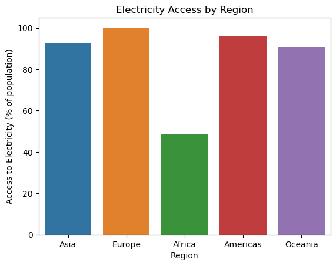
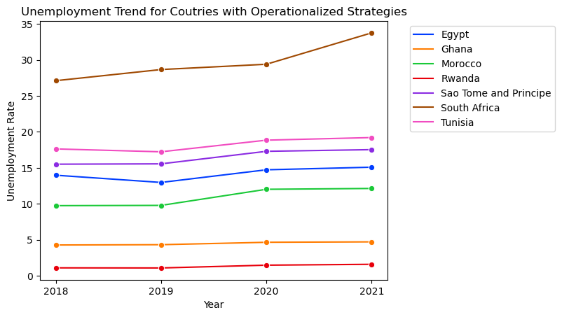
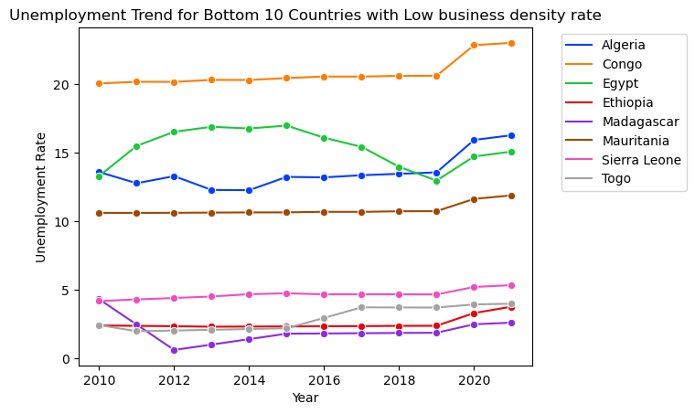

## Unraveling the Challenges of Unemployment in Africa: _A Data-Driven Approach_

---

## Introduction
This is a project for the **10Alytics Global Hackathon 2023** which allowed analysts to delve into various datasets to uncover insights and strategies that could assist in mitigating the unemployment crisis in Africa. 

## Objective
To analyze data, identify patterns, and propose informed, data-driven recommendations that governments and stakeholders can implement to effectively address and reduce unemployment rates, particularly focusing on the African context.

## Data Description
Six datasets were provided with each having unique information on the factors influencing unemployment. The datasets are outlined below as described for the hackathon.
- Unemployment Rate (Men vs. Women): This dataset provides a comparative view of unemployment rates between genders.
- National Strategy for Youth Employment: This dataset outlines various national strategies adopted across different African countries to combat youth unemployment.
- Share of Education in Government Expenditure: This dataset sheds light on how much governments are investing in education.
- Population with Access to Electricity: Access to electricity is a fundamental driver of economic development and can influence employment opportunities. This dataset provides insights into the availability of electricity across different regions and its potential impact on employment.
- Total Firms (Historical Data): The health of a country's private sector is directly linked to employment rates. This dataset includes historical data on the number of firms.
- Country Codes: This dataset is essential for mapping data points to specific African countries, enabling a more precise and geographically contextual analysis.

## Skills / Concepts Demostrated
- Data Manipulation with Pandas
- Data Visualization
- Data Analysis
- Proficiency in Python Programming Language

## Data Cleaning and Transformation
The datasets were provided in a csv format and were imported into jupyter notebook using the pandas library. Data cleaning and transformation were all carried out using python. The cleaning was done separately for each dataset.

The unemployment rate dataset has 58578 records and 7 features. They had no duplicates and in the right data types. The year column has some negative entries and there were missing rows of 52347 in both male and female unemployment rates column. It was then confirmed that both columns have exact rows with missing values. Hence, they were dropped. The rows with negative in the year column got removed along with the missing values. The continent column has missing rows. To tackle this, the dataset was merged with the country code dataset that has the continents. Some columns were renamed to short and meaningful names and some unwanted columns were deleted.Another column was created for the average unemployment rates for both male and female across the rows which would be useful for the analysis.

The dataset for national strategy for youth employment had no duplicates, no missing values and in correct datatype. The dataset was also merged with the country code dataset to have the regions and subregions required for analysis. Some unwanted columns were dropped after merging and others renamed meaningfully.

The dataset for the share of education in government expenditure had missing values in the code column that contains three letter code representing each country. These rows were filtered and were not identified as countries. Hence no codes for them and were removed. It was also merged with the country code dataset for the same reason.

The dataset for the population with access to electricity also had missing values in the code columns and were filtered and not identified as countries. These rows were then removed.

The dataset for the total number of firms had 4 missing values and were dropped as all the columns were NaN. It was merged with the country code dataset and the code column had missing values. They were filtered and errors such as misspellings, empty space, non-alphabets were identified and corrected. The codes, regions and subregions for some countries were inputed.

## Exploratory Analysis

The exploratory analysis was performed for all the variables by gender, region and countries (in Africa). For recency, the years connsidered in this analysis sttarts from 2010.

### _Exploratory Analysis by Region_

This was performed for the the national strategy, access to electricity, share of education in government expenditure and the business density rates for all the regions to understand their distribution and effect on unemployment rates. Also, the unemployment rate y gender was explored.
'                                          | '                       | '
:-----------------------------------------:|:-----------------------:|:-----------------------:
                  | | 

'                                           | '                       | ' 
:-----------------------------------------:|:-----------------------:|:-----------------------:
                  |  |  

### _Unemployment Rates in Africa_
The plots show the top and bottom 10 countries in Africa with the highest and lowest unemployment rates respectively
'                                          | '
:-----------------------------------------:|:-----------------------:
             |  

### _National Strategies for Youth Employment_
This has four categories where 0 represents no strategy, 1 represents developing strategy, 2 represents strategy developed and 3 strategy operationalized starting from 2019 to 2022. The plots show the countries with operationalized strategies in Africa and their unemployment rates. The operationalized strategies were focused on because it is expected to have improved unemployment rates.
To check the effect of the operationalized strategies on employment rates, the countries with operationalized strategies in africa were selected and their corresponding unemployment rates starting from 2018.
'                                      | '
:-----------------------------------------:|:-----------------------:
|  

### _Share of Education in Government Expenditure_
This shows the percentages of government expenditure that has been invested in education from 2010 for different african countries.  It is shown for the top 10 highest and lowest share and the effect on their unemployment rates

African Countries with most share of education in government expenditure and the effect on their unemployment rates
'                                       | '
:-----------------------------------------:|:-----------------------:
             |  

African Countries with low share of education in government expenditure and the effect on their unemployment rates
'                                       |'
:-----------------------------------------:|:-----------------------:
             |  

### _Share of Population with Access to Electricity_
This describes the percentage of the entire population that have access to electricity in Africa and their unemployment rates           

The top 10 countries in Africa that most percentage of their population have access to electricity and their unemployment trend
'                                     | '
:-----------------------------------------:|:-----------------------:
             |  

The bottom 10 countries in Africa that have low percentage of their population with access to electricity and their unemployment trend

'                                    |'
:-----------------------------------------:|:-----------------------:
             |  

### _Total Business Density Rates_
The top 10 number of registered firms per 1,000 working-age people is shown here for countries in Africa and their respective unemployment rates 
'                                    |'
:-----------------------------------------:|:-----------------------:
             |  

The bottom 10 number of registered firms per 1,000 working-age people is shown here for countries in Africa and their respective unemployment rates 

'                                    |'
:-----------------------------------------:|:-----------------------:
             |  

### _Relationship between all Variables_
This shows the correlation between all the variables in the merged dataframe
            

# Insights

# Recommendations
